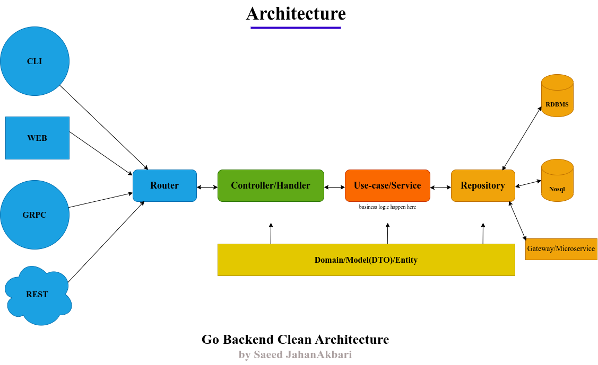

# Go Backend Clean Architecture

A Go (Golang) Backend Clean Architecture Project Based on <a href="https://blog.cleancoder.com/uncle-bob/2012/08/13/the-clean-architecture.html"> **Uncle Bob's Clean Architecture** </a> And <a href="https://github.com/golang-standards/project-layout">
    **Standard Go Project
    Layout** </a> with Echo, MysqlDB, JWT Authentication Middleware, Test, and Docker.

<section style="text-align: center;margin: auto">


</section>

**In Golang language, there is no specific structure for Backend projects, and this sometimes causes confusion for developers, especially junior developers.**

**You can use this project as a template to build your Backend project in the Go language on top of this project.**

Before creating this project, I have gone through more than XX projects related to the Go(Golang) Clean Architecture on GitHub.

Thanks to all those projects, I learned a lot from all of those. As I keep saying:

> The best way to learn to code is to code. But, to write good code, you will also have to read good code. Make a habit of reading good code. You can find many open-source projects on GitHub and start reading.

Then for the implementation part, I combined all of my ideas, experiences, and learnings from those projects to create this project.

And as always I would love to get feedback on my project. This helps everyone and most importantly me.

Learn about this project architecture in detail from the blogs mentioned below:
- A
- B
- C

## Architecture Layers of the project

- Router
- Controller/Handler
- Service/Use-case
- Repository
- Domain/Entities



## Major Packages used in this project

- **echo**: The Echo project is a powerful and versatile web framework for building scalable and high-performance web.
applications in the Go programming language. It follows the principles of simplicity, flexibility, and performance to
provide developers with an efficient toolkit for building robust web applications..
- **jwt**: JSON Web Tokens are an open, industry-standard RFC 7519 method for representing claims securely between two
parties. Used for Access Token and Refresh Token.
- **viper**: Go configuration with fangs.
- **ozzo-validation**: An idiomatic Go (golang) validation package. Supports configurable and extensible validation rules (validators) using normal language constructs instead of error-prone struct tags.
- **bcrypt**: Package bcrypt implements Provos and Mazières's bcrypt adaptive hashing algorithm.

## How to run this project?

We can run this Go Backend Clean Architecture project with or without Docker. Here, I am providing both ways to run this project.

- Clone this project

```
# Move to your workspace
cd your-workspace

# Clone this project into your workspace
git clone https://github.com/saeedjhn/go-backend-clean-arch.git

# Move to the project root directory
cd go-backend-clean-arch
```

**Run without Docker**
- A
- B

**Run with Docker**
- A
- B


## The Complete Project Folder Structure

```
.
+-- assets
|   +-- backend-arch-diagram.png
+-- README.md

```

## TODO

- Serialize And Deserialize JSON Added In Project
- Added password hashing

## API documentation of Go Backend Clean Architecture

<a href="https://documenter.getpostman.com/view/10523269/2sA3QqgD5c" target="_blank" style="text-decoration: none;">
    <button style="display: inline-block;background-color: purple;color: black;padding: 1.4rem;border: none">
        View API Doc Button
    </button>
</a>

## If this project helps you in anyway, show your love ❤️ by putting a ⭐ on this project ✌️

**License**

Copyright (C) 2024 Saeed JahanAkbari

Licensed under the Apache License, Version 2.0 (the "License");
you may not use this file except in compliance with the License.
You may obtain a copy of the License at

http://www.apache.org/licenses/LICENSE-2.0

Unless required by applicable law or agreed to in writing, software
distributed under the License is distributed on an "AS IS" BASIS,
WITHOUT WARRANTIES OR CONDITIONS OF ANY KIND, either express or implied.
See the License for the specific language governing permissions and
limitations under the License.

**Contributing to Go Backend Clean Architecture**

All pull requests are welcome.


