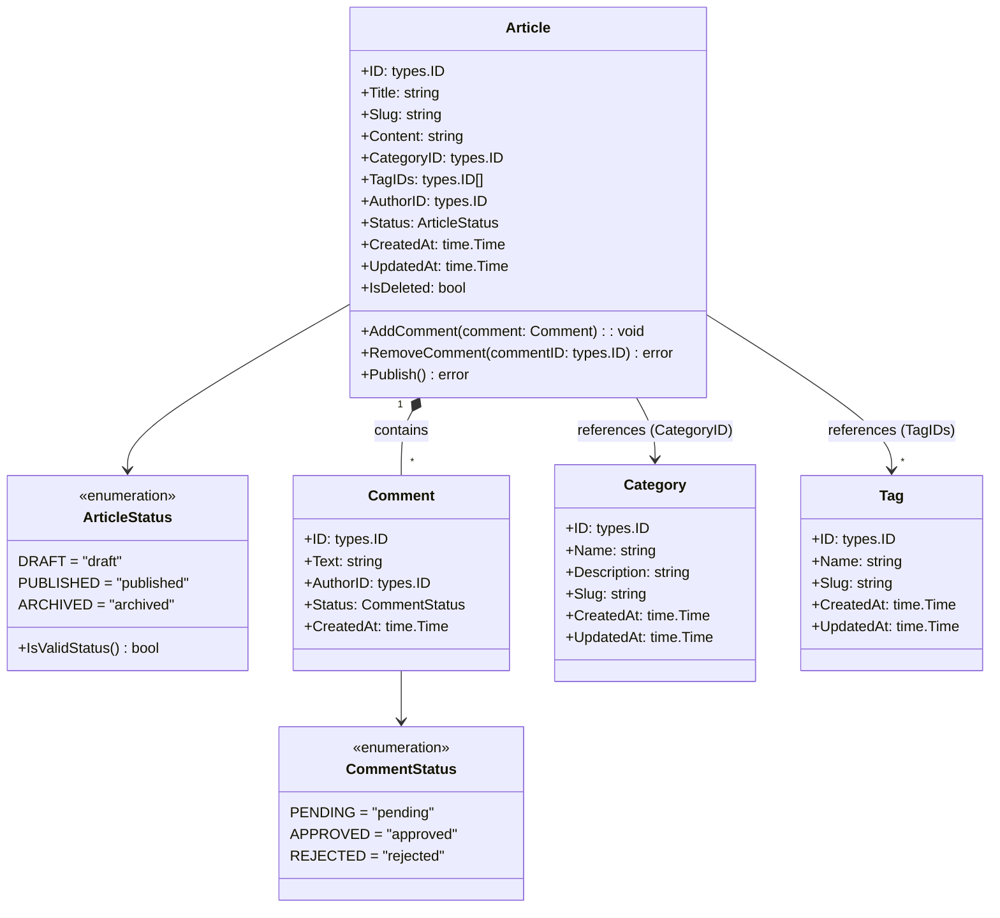

```mermaid
classDiagram
%% Enums
    class ArticleStatus {
        <<enumeration>>
        DRAFT = "draft"
        PUBLISHED = "published"
        ARCHIVED = "archived"
        +IsValidStatus() bool
    }

    class CommentStatus {
        <<enumeration>>
        PENDING = "pending"
        APPROVED = "approved"
        REJECTED = "rejected"
    }

%% Article (Aggregate Root)
    class Article {
        +ID: types.ID
        +Title: string
        +Slug: string
        +Content: string
        +CategoryID: types.ID
        +TagIDs: types.ID[]
        +AuthorID: types.ID
        +Status: ArticleStatus
        +CreatedAt: time.Time
        +UpdatedAt: time.Time
        +IsDeleted: bool
        +AddComment(comment: Comment): void
        +RemoveComment(commentID: types.ID) error
        +Publish() error
    }

%% Comment (Child Entity)
    class Comment {
        +ID: types.ID
        +Text: string
        +AuthorID: types.ID
        +Status: CommentStatus
        +CreatedAt: time.Time
    }

%% Category (Aggregate Root)
    class Category {
        +ID: types.ID
        +Name: string
        +Description: string
        +Slug: string
        +CreatedAt: time.Time
        +UpdatedAt: time.Time
    }

%% Tag (Aggregate Root)
    class Tag {
        +ID: types.ID
        +Name: string
        +Slug: string
        +CreatedAt: time.Time
        +UpdatedAt: time.Time
    }

%% Relationships
    Article "1" *-- "*" Comment: contains
    Article --> Category: references (CategoryID)
    Article --> "*" Tag: references (TagIDs)
    Article --> ArticleStatus
    Comment --> CommentStatus
```